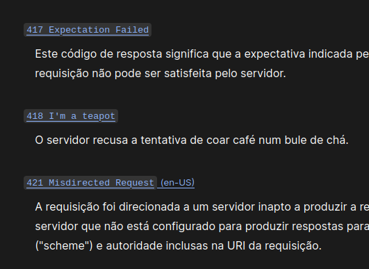

# Exercícios de Fixação

## 01

O que é o Entity Framework?

**Resposta**

É um framework ORM. 
Serve como interface entre as aplicações .NET e os bancos de dados. 
Faz o mapeamento entre o mundo orientado a objetos e o relacional.

## 02

O que é "Code First" e "Database First"? Qual a diferença entre eles e quais as 
vantagens e desvantagens entre cada uma das abordagens?

**Resposta**

São duas abordagens possíveis para usar o Entity Framework.

```Code first```: Significa código primeiro. 
Onde primeiro cria-se o código e depois se constrói o banco de dados. 
O banco de dados é modelado e construído a partir dos models. 

```Database First```: É a abordagem para quando já se tem o banco modelado.
O entity vai criar os models usando as entidades existentes no banco.

## 03

O que é uma API? Dê exemplos de algumas reais.

**Resposta**

```API```: Application Programming Interface.

Uma API é uma interface que define protocolos para a interação entre aplicações.

Elas definem como a comunicação deve ser feita entre um cliente e um serviço.

**Exemplos**

- `API Web`: elas utilizam o protocolo HTTP para regular as requisições.
  
- Os sistemas operacionais possuem API para que as aplicações façam requisições
  de recursos da máquina aos quais não se tem acesso. A aplicação acessa a api 
  o SO manipula o recurso.

## 04

Como você cria um novo projeto API no .NET Core usando o CLI 
(Interface de Linha de Comando)?

**Resposta**

É só mandar o .NET usar o template `webapi`.

`dotnet new webapi -n <nome da api>`

## 05

O que é o modelo de request/response e como ele se aplica ao funcionamento da web?

**Resposta**

`Request`: É a requisição que o cliente faz a API. Ela tem um método HTTP e pode
ou não ter um corpo. O cliente envia os dados necessários e deve respeitar os
contratos definidos na API.

`Response`: É a resposta da API ao cliente. Ela vai retornar o conteúdo 
requisitado junto de um status code.

## 06

Quais são os principais métodos HTTP e quais são suas funções típicas em uma 
aplicação web?

**Resposta**

`GET`: 
- Método para leitura de recursos. 
- Não permite corpo.
- Os dados devem ser enviados via rota, query ou header.

`Post`:
- Método para criação de recursos.
- Permite envio de dados no corpo da requisição.

`PUT`:
- Método para atualização de um recurso.
- Permite o envio de dados no corpo da requisição.
- Se o recurso não existir, deve-se criá-lo, desde que a requisição atenda as 
  regras de negócio.

`PATCH`:
- Método para atualização de um recurso.
- Não é preciso atualizar todas as informações do recurso. Só as que foram
  recebidas do cliente.
- Permite o envio de dados no corpo da requisição.

`DELETE`:
- Método para excluir um recurso.

## 07

O que é um código de status HTTP e como ele informa ao cliente sobre o resultado
de sua request? 
Poderia citar e explicar três códigos de status HTTP comuns?

**Resposta**

`200`: A requisição foi bem sucedida. O significado varia de acordo com o método
HTTP.

`201`: O recurso foi criado com sucesso.

`204`: A requisição foi bem sucedida, mas não existe conteúdo de reposta.

`400`: Bad Request. O cliente fez uma requisição que não respeita a estrutura
estabelecida.

`401`: Usuário não autenticado.

`403`: O usuário não tem direito de acesso ao recurso requisitado.

`404`: O recurso não foi encontrado.

**Bônus**

`418`: I am a teaspot.

- Screenshot da documentação do MDN web docs da Mozilla.
  

  

## 08

Qual a diferença fundamental entre status codes na faixa dos 4xx e os da faixa
do 5xx?

**Resposta**

`4xx`: Faixa que representa erros relacionados ao cliente e a requisição.

`5xx`: Faixa que representa erros relacionados ao servidor.
Um comportamento inesperado.


## 09

Como você pode definir relações entre entidades 
(como relações um-para-muitos ou muitos-para-muitos) usando o EF Core?

**Resposta**

O entity cria as relações usando os models como base.

Se existir uma lista de objetos ou uma referência a um objetos de outro model,
ele cria o relacionamento. Os models precisam ser definidos no context usando o
`DBSet<Model>`.

Outra opção é criar o relacionamento explicitamente usando a `Fluent API`.

**Usando a Fluent API**

```c#
builder
    .HasMany(collaborator => collaborator.Projects)
    .WithMany(project => project.Collaborators)
    .UsingEntity(join => join.ToTable("CollaboratorProject"));
```

## 10

Explique o propósito de um controller

**Resposta**

Na arquitetura MVC, o controlador faz o meio campo entre a view e o model.

Em uma API WEB em que o usuário interage com o cliente, e o cliente faz uma 
requisição HTTP. O controller fica responsável pelo recebimento da requisição,
chamar os serviços necessários e devolver uma `Response` adequada.

## 11

Como você pode definir rotas personalizadas em um controller no .NET Core para 
mapear diferentes ações?

**Resposta**

Utilizando a `annotation` `[Route("rota")]`

```c#
[APIController]
[Route("rota")]
public class Controller : ControllerBase {}
```

## 12

O que é, para que servem e como criamos e aplicamos migrations?

**Resposta**

- O que é?

São instruções para alterar a estrutura do banco de dados.

- Para que servem?
  
  Servem para manter o banco e o código alinhados, já que são duas aplicações
  separadas.

  As migrations são pontos salvos na história do banco. Elas possuem caminho
  de ida e volta, podendo ser revertidas.

  As migrations permitem que o time todo tenha o mesmo banco banco de dados.

- Como criar uma migration:

`dotnet ef migrations add <nome da migration>`

- Como aplicar as migrations:

`dotnet ef database update`

## 13

De que formas podemos gerenciar a autenticação de um usuário numa aplicação 
.NET core?

**Resposta**

Pode-se fazer tudo na mão, ou usar o Identity Framework.

O Identity possui várias funcionalidades prontas para a autenticação do usuário.

## 14

O que é um JWT?

**Resposta**

`Json Web Token`

É um token que contem informações do usuário. 
É usado para gerenciar as sessões login dos usuário que acessam a API.
O token é codificado, mas pode ser decodificado facilmente.

É usado um segredo na hora de gerar o token, isso cria uma assinatura,
permitindo que API saiba se o token é confiável ou não.

# Mini-Desafio

Desenvolver uma API que servirá para um app de To-Do que estamos desenvolvendo. 
Nessa API o usuário poderá cadastrar, ler, atualizar e remover tarefas.

## Especificações:

A tarefa deve ter as seguintes propriedades:

- Id (int)
- Título (string)
- Descrição (string)
- Data de Criação (DateTime)
- Status (bool - para determinar se a tarefa foi concluída ou não)

**Endpoints**: Sua API deve ter os seguintes endpoints:

- `GET /tarefas`: Retorna todas as tarefas.
- `GET /tarefas/{id}`: Retorna uma tarefa específica com base no ID.
- `POST /tarefas`: Cria uma nova tarefa.
- `PUT /tarefas/{id}`: Atualiza uma tarefa existente com base no ID.
- `DELETE /tarefas/{id}`: Exclui uma tarefa com base no ID.

**Persistência**: Use uma abordagem de "in-memory database" 
(como o InMemoryDatabase do Entity Framework Core) para simplificar. 
Não é necessário um banco de dados real para este mini-desafio.
